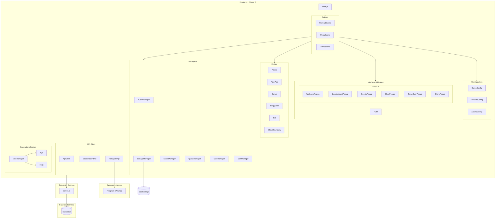
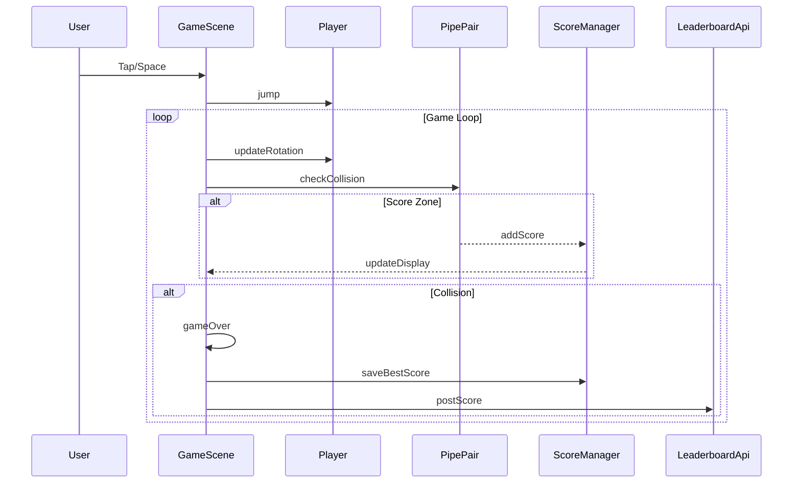

# Architecture du projet Flappy Borgy

## Table des matières

1. [Vue d'ensemble](#vue-densemble)
2. [Analyse de la structure actuelle](#analyse-de-la-structure-actuelle)
3. [Composants logiques identifiés](#composants-logiques-identifiés)
4. [Proposition d'architecture modulaire](#proposition-darchitecture-modulaire)
5. [Diagramme d'architecture](#diagramme-darchitecture)
6. [Plan de migration](#plan-de-migration)

---

## Vue d'ensemble

**Flappy Borgy** est un jeu de type Flappy Bird développé avec le framework **Phaser 3**. Le jeu est intégré à **Telegram WebApp** et dispose d'un système de leaderboard connecté à une API backend utilisant **Supabase**.

### Stack technique actuel

| Composant | Technologie |
|-----------|-------------|
| Frontend/Jeu | Phaser 3.80.0 |
| Backend API | Express.js (Node 20.x) |
| Base de données | Supabase |
| Intégration | Telegram WebApp |
| Hébergement | Render.com |

---

## Analyse de la structure actuelle

### Fichiers du projet

```
Flappy-Borgy-main/
├── package.json          # Configuration Node.js (API)
├── server.js             # Serveur Express (284 lignes)
├── public/
│   ├── index.html        # Page HTML (31 lignes)
│   ├── game.js           # Code complet du jeu (3032 lignes) ⚠️
│   └── assets/           # Ressources graphiques et audio
```

### Problèmes identifiés

1. **Fichier monolithique** : [`game.js`](public/game.js) contient ~3000 lignes avec toute la logique du jeu
2. **Couplage fort** : Les différentes fonctionnalités sont entremêlées
3. **Difficile à maintenir** : Modifications risquées car tout est dans un seul fichier
4. **Pas de séparation des responsabilités** : UI, logique de jeu, persistance et API mélangés
5. **Duplication de code** : La méthode [`showLeaderboard()`](public/game.js:1022) est dupliquée dans MenuScene et GameScene

---

## Composants logiques identifiés

### 1. Classes Phaser (Scènes)

| Classe | Lignes | Description |
|--------|--------|-------------|
| [`PreloadScene`](public/game.js:686) | 686-777 | Chargement des assets |
| [`MenuScene`](public/game.js:780) | 780-1655 | Menu principal et popups |
| [`GameScene`](public/game.js:1658) | 1658-3018 | Logique de jeu |

### 2. Systèmes fonctionnels

#### Internationalisation (i18n)
- **Lignes** : 72-259
- **Fonctions** : [`loadLang()`](public/game.js:231), [`saveLang()`](public/game.js:239), [`currentLang()`](public/game.js:243), [`setLang()`](public/game.js:250), [`t()`](public/game.js:256)
- **Données** : Objet [`I18N`](public/game.js:76) avec traductions FR/EN

#### Gestion Audio
- **Lignes** : 261-294
- **Fonction principale** : [`ensureBgm()`](public/game.js:262)

#### API Leaderboard
- **Lignes** : 311-346
- **Fonctions** : [`tgInitData()`](public/game.js:313), [`postScore()`](public/game.js:316), [`fetchLeaderboard()`](public/game.js:329)

#### Persistance locale (Score)
- **Lignes** : 348-363
- **Fonctions** : [`loadLocalBestScore()`](public/game.js:349), [`saveLocalBestScore()`](public/game.js:356)

#### Système de Quêtes
- **Lignes** : 365-498
- **Fonctions** : [`todayKey()`](public/game.js:368), [`generateDailyQuests()`](public/game.js:377), [`loadQuests()`](public/game.js:422), [`saveQuests()`](public/game.js:436), [`applyQuestCoins()`](public/game.js:452), [`updateQuestsFromEvent()`](public/game.js:472)

#### Système de monnaie (Borgy Coins)
- **Lignes** : 440-449
- **Fonctions** : [`loadBorgyCoins()`](public/game.js:440), [`saveBorgyCoins()`](public/game.js:447)

#### Système de Skins
- **Lignes** : 500-683
- **Définitions** : [`SKINS_DEF`](public/game.js:503)
- **Fonctions** : [`loadSkinState()`](public/game.js:516), [`saveSkinState()`](public/game.js:567), [`getSelectedSkinKey()`](public/game.js:573), [`selectSkin()`](public/game.js:581), [`tryBuySkin()`](public/game.js:592), [`getVisibleBounds()`](public/game.js:612), [`computeSkinScale()`](public/game.js:651)

### 3. Constantes et configuration

| Groupe | Lignes | Description |
|--------|--------|-------------|
| Dimensions jeu | 11 | `GAME_W`, `GAME_H` |
| Profil physique | 13-19 | `PROFILE` (gravity, jump, pipeSpeed, gap, spawnDelay) |
| Configuration pipes | 21-37 | Dimensions, hitbox, positions |
| Arrière-plans | 27-29 | Clés des backgrounds |
| Zone de jeu | 31-37 | Limites playfield |
| Bonus | 42-45 | Configuration bonus |
| Mode Hard | 51-54 | Animation portes |
| Nuages | 56-60 | Dimensions kill zones |
| Difficulté | 297-309 | `DIFF` (progression) |

### 4. Entités de jeu (dans GameScene)

| Entité | Type | Description |
|--------|------|-------------|
| Player | Sprite | Le personnage Borgy |
| Pipes | Group | Tuyaux obstacles |
| Sensors | Group | Détecteurs de score |
| Bonuses | Group | Bonus SwissBorg |
| BorgyCoins | Group | Pièces à collecter |
| Bots | Group | Robots ennemis |
| Clouds | Image | Limites haut/bas (nuages) |
| PipeDecor | Group | Décorations des tuyaux |

---

## Proposition d'architecture modulaire

### Nouvelle structure de fichiers

```
public/
├── index.html
├── js/
│   ├── main.js                    # Point d'entrée, configuration Phaser
│   │
│   ├── config/
│   │   ├── GameConfig.js          # Constantes du jeu (dimensions, physique)
│   │   ├── DifficultyConfig.js    # Configuration de difficulté
│   │   └── AssetsConfig.js        # Chemins des assets
│   │
│   ├── i18n/
│   │   ├── I18nManager.js         # Gestionnaire de traductions
│   │   ├── locales/
│   │   │   ├── fr.js              # Traductions françaises
│   │   │   └── en.js              # Traductions anglaises
│   │
│   ├── managers/
│   │   ├── AudioManager.js        # Gestion musique et sons
│   │   ├── StorageManager.js      # localStorage (abstraction)
│   │   ├── ScoreManager.js        # Gestion des scores
│   │   ├── QuestManager.js        # Système de quêtes
│   │   ├── CoinManager.js         # Gestion des Borgy Coins
│   │   └── SkinManager.js         # Gestion des skins
│   │
│   ├── api/
│   │   ├── ApiClient.js           # Client HTTP générique
│   │   ├── LeaderboardApi.js      # Appels API leaderboard
│   │   └── TelegramApi.js         # Intégration Telegram WebApp
│   │
│   ├── entities/
│   │   ├── Player.js              # Classe joueur
│   │   ├── Pipe.js                # Classe tuyau
│   │   ├── PipePair.js            # Gestionnaire de paire de tuyaux
│   │   ├── Bonus.js               # Classe bonus SwissBorg
│   │   ├── BorgyCoin.js           # Classe pièce
│   │   ├── Bot.js                 # Classe robot ennemi
│   │   └── CloudBoundary.js       # Classe nuage (limite)
│   │
│   ├── scenes/
│   │   ├── PreloadScene.js        # Scène de chargement
│   │   ├── MenuScene.js           # Scène menu principal
│   │   └── GameScene.js           # Scène de jeu
│   │
│   ├── ui/
│   │   ├── popups/
│   │   │   ├── BasePopup.js       # Classe popup de base
│   │   │   ├── WelcomePopup.js    # Popup de bienvenue
│   │   │   ├── LeaderboardPopup.js# Popup leaderboard
│   │   │   ├── QuestsPopup.js     # Popup quêtes
│   │   │   ├── ShopPopup.js       # Popup boutique
│   │   │   ├── GameOverPopup.js   # Popup fin de partie
│   │   │   └── SharePopup.js      # Popup partage
│   │   ├── components/
│   │   │   ├── Button.js          # Composant bouton
│   │   │   ├── ScoreDisplay.js    # Affichage du score
│   │   │   └── CoinDisplay.js     # Affichage des coins
│   │   └── HUD.js                 # Interface en jeu
│   │
│   └── utils/
│       ├── MathUtils.js           # Fonctions mathématiques
│       └── TextureUtils.js        # getVisibleBounds, computeSkinScale
│
└── assets/
    └── (inchangé)
```

### Description des modules

#### `config/`
Centralise toutes les constantes et configurations du jeu.

```javascript
// GameConfig.js
export const GAME = {
  WIDTH: 1024,
  HEIGHT: 1536,
  PROFILE: {
    gravity: 1400,
    jump: -390,
    pipeSpeed: -220,
    gap: 260,
    spawnDelay: 2450
  }
};
```

#### `managers/`
Services singleton gérant les différents systèmes du jeu.

```javascript
// ScoreManager.js
export class ScoreManager {
  constructor(storageManager) { ... }
  loadBestScore() { ... }
  saveBestScore(score) { ... }
  getCurrentScore() { ... }
  addScore(points) { ... }
}
```

#### `entities/`
Classes représentant les objets de jeu avec leur logique propre.

```javascript
// Player.js
export class Player {
  constructor(scene, x, y, skinKey) { ... }
  jump() { ... }
  updateRotation() { ... }
  applyHitbox() { ... }
  revive(targetX, targetY) { ... }
}
```

#### `scenes/`
Les scènes Phaser allégées, déléguant aux managers et entités.

```javascript
// GameScene.js
import { Player } from '../entities/Player.js';
import { PipePair } from '../entities/PipePair.js';
import { ScoreManager } from '../managers/ScoreManager.js';

export class GameScene extends Phaser.Scene {
  create() {
    this.player = new Player(this, ...);
    this.scoreManager = new ScoreManager(...);
    // ...
  }
}
```

#### `ui/popups/`
Composants UI réutilisables pour les fenêtres modales.

```javascript
// BasePopup.js
export class BasePopup {
  constructor(scene, config) { ... }
  show() { ... }
  hide() { ... }
  destroy() { ... }
}
```

---

## Diagramme d'architecture



### Diagramme de flux du jeu



---

## État de l'implémentation

> ✅ **Toutes les phases de la refactorisation sont terminées !**

### Structure actuelle implémentée

```
public/
├── index.html                       # ✅ Mis à jour avec import ES6 module
├── game.js                          # ⚠️ Conservé pour fallback (non utilisé)
├── js/
│   ├── main.js                      # ✅ Point d'entrée principal
│   ├── index.js                     # ✅ Index global d'exports
│   │
│   ├── config/
│   │   ├── index.js                 # ✅ Index des configurations
│   │   ├── constants.js             # ✅ Toutes les constantes du jeu
│   │   ├── gameConfig.js            # ✅ Configuration Phaser
│   │   └── skinConfig.js            # ✅ Définitions des skins
│   │
│   ├── i18n/
│   │   ├── translations.js          # ✅ Traductions FR/EN
│   │   └── i18nManager.js           # ✅ Gestionnaire de langue
│   │
│   ├── managers/
│   │   ├── index.js                 # ✅ Index des managers
│   │   ├── StorageManager.js        # ✅ Abstraction localStorage
│   │   ├── AudioManager.js          # ✅ Gestion audio/musique
│   │   ├── CoinManager.js           # ✅ Gestion des Borgy Coins
│   │   ├── SkinManager.js           # ✅ Gestion des skins
│   │   ├── QuestManager.js          # ✅ Système de quêtes
│   │   └── LeaderboardManager.js    # ✅ API leaderboard
│   │
│   ├── entities/
│   │   ├── index.js                 # ✅ Index des entités
│   │   ├── Player.js                # ✅ Classe joueur
│   │   ├── Pipe.js                  # ✅ Classe tuyau + factory
│   │   ├── Bonus.js                 # ✅ Bonus SwissBorg
│   │   ├── BorgyCoin.js             # ✅ Pièces Borgy
│   │   ├── Bot.js                   # ✅ Robot ennemi
│   │   ├── Cloud.js                 # ✅ Nuages limites
│   │   └── Background.js            # ✅ Arrière-plans
│   │
│   ├── scenes/
│   │   ├── index.js                 # ✅ Index des scènes
│   │   ├── PreloadScene.js          # ✅ Chargement assets
│   │   ├── MenuScene.js             # ✅ Menu principal
│   │   └── GameScene.js             # ✅ Logique de jeu
│   │
│   ├── utils/
│   │   ├── index.js                 # ✅ Index des utilitaires
│   │   └── helpers.js               # ✅ Fonctions utilitaires
│   │
│   ├── ui/popups/
│   │   └── .keep                    # 📋 Structure préparée pour extension
│   │
│   └── api/
│       └── .keep                    # 📋 Structure préparée pour extension
│
└── assets/                          # (inchangé)
```

---

## Plan de migration (historique)

### Phase 1 : Extraction des configurations ✅
1. ✅ Créer `config/constants.js` avec toutes les constantes
2. ✅ Créer `config/gameConfig.js` pour la configuration Phaser
3. ✅ Créer `config/skinConfig.js` pour les skins et arrière-plans

### Phase 2 : Système d'internationalisation ✅
1. ✅ Créer `i18n/translations.js` avec les traductions FR/EN
2. ✅ Créer `i18n/i18nManager.js` pour la gestion des langues

### Phase 3 : Managers ✅
1. ✅ Créer `managers/StorageManager.js` (abstraction localStorage)
2. ✅ Créer `managers/AudioManager.js`
3. ✅ Créer `managers/CoinManager.js`
4. ✅ Créer `managers/QuestManager.js`
5. ✅ Créer `managers/SkinManager.js`
6. ✅ Créer `managers/LeaderboardManager.js`

### Phase 4 : Entités ✅
1. ✅ Créer `entities/Player.js`
2. ✅ Créer `entities/Pipe.js` (avec PipeFactory)
3. ✅ Créer `entities/Bonus.js` (avec BonusManager)
4. ✅ Créer `entities/BorgyCoin.js` (avec BorgyCoinManager)
5. ✅ Créer `entities/Bot.js` (avec BotManager)
6. ✅ Créer `entities/Cloud.js` (avec CloudManager)
7. ✅ Créer `entities/Background.js` (avec BackgroundFactory)

### Phase 5 : Intégration finale ✅
1. ✅ Créer `config/index.js` - exports des configurations
2. ✅ Créer `managers/index.js` - exports des managers
3. ✅ Créer `entities/index.js` - exports des entités
4. ✅ Créer `utils/helpers.js` - fonctions utilitaires
5. ✅ Créer `utils/index.js` - exports des utilitaires
6. ✅ Créer `js/index.js` - index global réexportant tout
7. ✅ Mettre à jour `main.js` - point d'entrée complet
8. ✅ Mettre à jour `index.html` - import ES6 module
9. ✅ Créer `scenes/index.js` - exports des scènes

---

## Notes importantes

### Utilisation des modules ES6

Pour utiliser l'architecture modulaire, le fichier HTML devra charger le script principal en tant que module :

```html
<script type="module" src="./js/main.js"></script>
```

### Compatibilité

Cette architecture est compatible avec :
- Phaser 3.x
- Navigateurs modernes supportant les modules ES6
- Telegram WebApp

### Avantages de cette architecture

1. **Maintenabilité** : Chaque module a une responsabilité unique
2. **Testabilité** : Les managers et entités peuvent être testés unitairement
3. **Réutilisabilité** : Les composants UI et les managers sont réutilisables
4. **Scalabilité** : Facile d'ajouter de nouvelles fonctionnalités
5. **Lisibilité** : Code organisé et facile à naviguer

---

*Document généré le 1er décembre 2025*